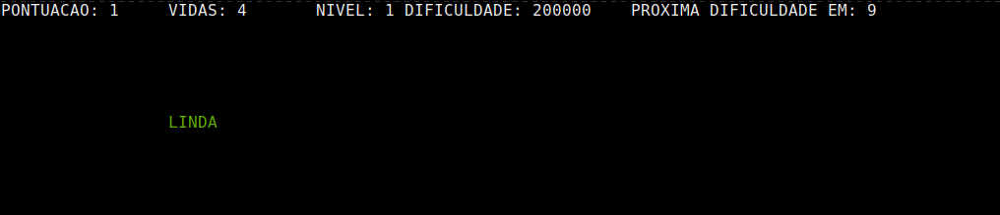
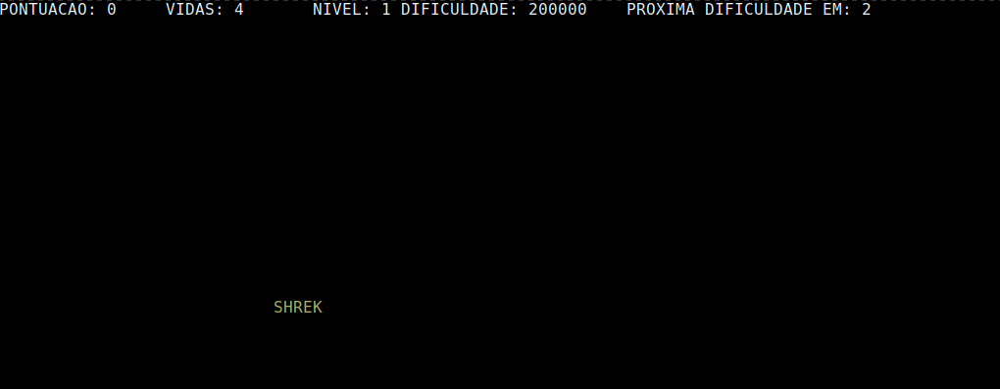
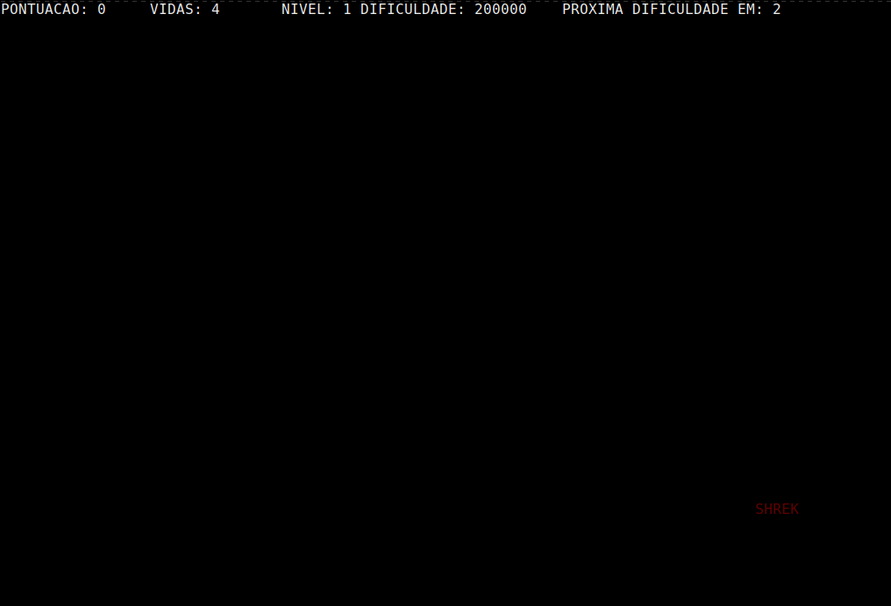

# Jogo desenvolvido visando a entrega do trabalho de IPC (Inter Process Communication) da matéria de Sistemas Operacionais

# Inspiração
### *https://zty.pe/*

## No que consiste?
> Digitar as palavras antes delas chegarem à borda inferior do terminal que o programa for executado

## Componentes do jogo
 - O terminal é responsivo, você pode aumentá-lo de acordo com a sua vontade
 - As palavras mudam de cor de acordo com a proximidade da borda
 - A dificuldade muda de acordo com o número de palavras que o jogador acerta, porém, o número exato para a dificuldade mudar é aleatório
 - O jogador possui 5 vidas, que são decrementadas quando uma palavra toca a borda inferior

 ## Demonstração




## Instruções para execução
> Você pode apenas *rodar* o executável 'ztype', ou se preferir, pode compilar novamente o código
```shell
    gcc ztype.c -o ztype
    ./ztype
```